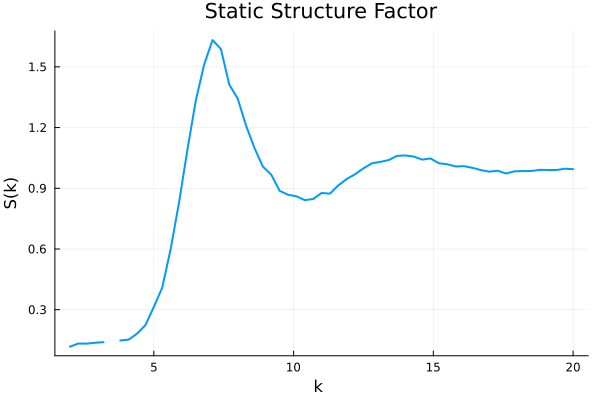
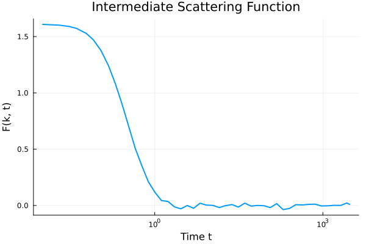
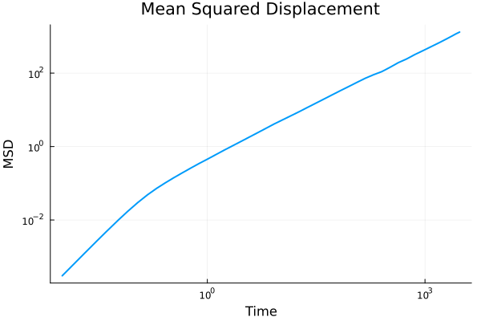

# Examples

This page provides examples for various analysis functions available in `SimulationAnalysis.jl`.

## Common Setup

All examples on this page use a sample trajectory file included with the package. The following code loads the simulation data and will be used as a common starting point for the examples below. We also assume that you have `Plots.jl` installed and loaded for the plotting examples.

```julia
using SimulationAnalysis
using Plots

# Construct the path to the test trajectory file
filepath = joinpath(dirname(pathof(SimulationAnalysis)), "..", "test", "data", "test_trajectory.h5")

# Load the simulation into a SingleComponentSimulation object
# If you have access to the data in some other format, you need to 
# construct a Simulation object manually.
sim = SimulationAnalysis.read_continuously_hard_sphere_simulation(filepath; time_origins=10)
dt = sim.t_array[2] - sim.t_array[1]
```

---


## Radial Distribution Function (g(r))

The radial distribution function describes the structure of the system.

```julia
# Set parameters for g(r) calculation
Nbins = 100
rmax = 5.0

# Calculate the radial distribution function
bin_centres, g_r = SimulationAnalysis.find_radial_distribution_function(sim, Nbins, rmax)

# Plot the g(r)
plot(bin_centres, g_r,
    xlabel="r (particle diameters)",
    ylabel="g(r)",
    title="Radial Distribution Function",
    legend=false,
    lw=2
)
```


---

## K-Space Analysis

These functions are used for analyzing the structure and dynamics in reciprocal space.

### Constructing K-Space

First, we need to construct the k-space vectors.

```julia
# Construct the k-space vectors
kspace = SimulationAnalysis.construct_k_space(sim, (0.0, 10.0); kfactor=1)
```
```
This is a SimulationAnalysis.KSpace{3, SimulationAnalysis.SingleComponentSimulation, OffsetArrays.OffsetArray{Int64, 3, Array{Int64, 3}}}.
It contains 
s: SimulationAnalysis.SingleComponentSimulation
Nk: 2418
k_lengths: Vector{Float64}
k_array: Matrix{Float64}
kfactor: 1
cartesian_to_linear: OffsetArrays.OffsetArray{Int64, 3, Array{Int64, 3}}
```
We can compute the corresponding density modes:
```julia
density_modes = SimulationAnalysis.find_density_modes(sim, kspace; verbose=false)
```
```
SingleComponentDensityModes with real and imaginary parts of size (430, 2418).
```

### Structure Factor (S(k))

The structure factor is the Fourier transform of the radial distribution function and describes the static correlations in the system.

```julia
# Calculate the structure factor for a specific k-range
S_k = SimulationAnalysis.find_structure_factor(sim; kmin=2.0, kmax=2.4)

println("Structure factor calculated: ", S_k)
```
```
Structure factor calculated: 0.12698982578981327
```

If the goal is to compute S(k) at many different points in k, it is more efficient to use the precomputed density modes from above
```julia
# Calculate the structure factor for a specific k-range
k_sample_arr = 2:0.3:10
S_k = SimulationAnalysis.find_structure_factor(sim, kspace, density_modes, k_sample_arr; k_binwidth=0.1)
plot(k_sample_arr, S_k,
    xlabel="k ",
    ylabel="S(k)",
    title="Static Structure Factor",
    legend=false,
    lw=2
)
```




The gap in the figure is caused by the absence of any wave vectors that have the length corresponding to that bin. 

---

### Intermediate Scattering Function (ISF)

The intermediate scattering function, F(k, t), measures the decay of density correlations at a specific wave vector `k` over time `t`.

```julia
# Calculate the intermediate scattering function for a specific k-range
isf = SimulationAnalysis.find_intermediate_scattering_function(sim; kmin=7.0, kmax=7.4)

# Plot the ISF
plot(dt * sim.dt_array[2:end], isf[2:end],
    xlabel="Time t",
    ylabel="F(k, t)",
    title="Intermediate Scattering Function",
    legend=false,
    lw=2,
    xaxis=:log
)
```


### Self-Intermediate Scattering Function (Self-ISF)

The self-intermediate scattering function, F_s(k, t), is the single-particle equivalent of the ISF. It measures the correlation of a single particle's position over time.

```julia
# Calculate the self-intermediate scattering function
self_isf, self_isf_per_particle = SimulationAnalysis.find_self_intermediate_scattering_function(sim, kspace; kmin=7.0, kmax=7.4)

# Plot the Self-ISF
plot(dt * sim.dt_array[2:end], self_isf[2:end],
    xlabel="Time",
    ylabel="F_s(k, t)",
    title="Self-Intermediate Scattering Function",
    legend=false,
    lw=2,
    xaxis=:log
)
```


---

## Neighbor Lists

Neighbor lists are used to efficiently find particles that are close to each other. These functions return lists of neighbors and are not typically plotted directly.

### Absolute Distance Neighbor List

This method finds all particles within a certain absolute distance of each other.

```julia
# Find neighbor lists based on a cutoff distance
neighborlists_abs = SimulationAnalysis.find_absolute_distance_neighborlists(sim, 2.0)

println("Absolute distance neighbor lists calculated for ", length(neighborlists_abs), " time steps.")
```
```
Absolute distance neighbor lists calculated for 430 time steps.
```

### Voronoi Neighbor List

This method uses Voronoi tessellation to determine neighbors. 

THIS IS CURRENTLY BROKEN ON JULIA 1.11 (QUICKHULL.jl segfaults)

```julia
# Find neighbor lists using Voronoi tessellation
neighborlists_voronoi = SimulationAnalysis.find_voronoi_neighborlists(sim)

println("Voronoi neighbor lists calculated for ", length(neighborlists_voronoi), " time steps.")
```
```
Voronoi neighbor lists calculated for 430 time steps.
```
---

## Bond Correlation Function (Cb)

The bond correlation function is used to study the dynamics of local structure. It requires neighbor lists as input.

```julia
# First, calculate neighbor lists (e.g., Voronoi)
neighborlists = SimulationAnalysis.find_absolute_distance_neighborlists(sim, 2.0)

# Calculate the bond correlation function for each particle
Cb_per_particle = SimulationAnalysis.find_CB(sim, neighborlists, neighborlists)
# average over particles
Cb = sum(Cb_per_particle, dims=2)[:] / size(Cb_per_particle, 2)

# Plot the bond correlation function for a single particle
plot(dt*sim.dt_array[2:end], Cb[2:end],
    xlabel="Time",
    ylabel="Cb(t)",
    title="Bond Correlation Function (Particle 1)",
    legend=false,
    lw=2,
    xscale=:log10
)
```


## Mean Squared Displacement (MSD)

The mean squared displacement is a measure of the average distance a particle travels over time. By default, the particles are stored as mapped into the main box. Therefore we need to reconstruct the data with the original trajectories.
```julia
# Calculate the mean squared displacement
sim_original = SimulationAnalysis.read_continuously_hard_sphere_simulation(filepath;
             time_origins=10, original=true)
msd = SimulationAnalysis.find_mean_squared_displacement(sim_original)

# Plot the MSD
plot(dt*sim.dt_array[2:end], msd[2:end],
    xlabel="Time",
    ylabel="MSD",
    title="Mean Squared Displacement",
    legend=false,
    lw=2,
    xscale=:log10,
    yscale=:log10,
)
```


---